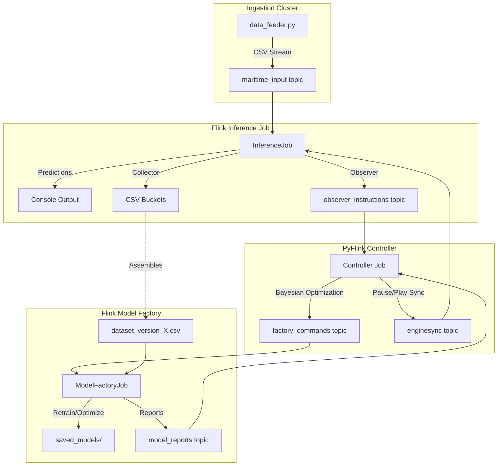

# Flink-RTCEF

[](https://flink.apache.org/)
[](https://www.python.org/)
[](https://www.java.com)
[](https://www.scala-lang.org/)
[](LICENSE)

> **Flink-based adaptation of the RTCEF (Run-Time Adaptation for Complex Event Forecasting) framework**

This project integrates the [RTCEF framework](https://github.com/manospits/rtcef) into [Apache Flink](https://flink.apache.org/), enabling scalable, distributed Complex Event Forecasting (CEF) with run-time model adaptation capabilities.

---

## 📖 Overview

### What is Complex Event Forecasting (CEF)?

Complex Event Forecasting (CEF) is the process of predicting complex events of interest over a stream of simple events. Unlike Complex Event Recognition (CER) which detects events reactively, CEF enables **proactive measures** by anticipating future occurrences with a degree of certainty.

**Real-world applications include:**

- 🚢 **Maritime Situational Awareness**: Forecasting vessel arrivals at ports for better resource management
- 💳 **Financial Fraud Detection**: Anticipating fraudulent transaction patterns before they complete
- 🏭 **Industrial IoT**: Predicting equipment failures or process anomalies

### The Challenge

CEF systems rely on probabilistic models trained on historical data. However, our world is constantly evolving:

- Maritime vessels adapt routes based on weather conditions
- Fraudsters evolve their tactics to avoid detection
- Operational patterns shift due to seasonal or external factors

This renders CEF systems **inherently susceptible to data evolutions** that can invalidate their underlying models.

### RTCEF: The Solution

**RTCEF** (Run-Time Adaptation for Complex Event Forecasting) is a novel framework that addresses these challenges through:

- ⚡ **Run-time model updates** with minimal downtime
- 🔄 **Lossless adaptation** — no forecasts are lost during model transitions
- 🎯 **Intelligent decision-making** — distinguishes between when to retrain vs. when to re-optimize hyperparameters
- 📊 **Bayesian optimization** for efficient hyperparameter tuning

> 📄 **Reference Paper**: [Run-Time Adaptation of Complex Event Forecasting](https://dl.acm.org/doi/10.1145/3701717.3730539)  
> *Pitsikalis M., Alevizos E., Giatrakos N., Artikis A. — DEBS '25 (19th ACM International Conference on Distributed and Event-based Systems)*

---

## 🎯 Project Goals

This project aims to **integrate RTCEF into Apache Flink** to leverage:

| Flink Capabilities | Benefits for RTCEF |
|-------------------|-------------------|
| **Distributed Processing** | Scale CEF across clusters for high-throughput streams |
| **Exactly-once Semantics** | Guarantee forecast reliability and consistency |
| **Event Time Processing** | Handle out-of-order events with watermarks |
| **State Management** | Efficiently manage PST models and automaton states |
| **Checkpointing** | Enable fault-tolerant CEF with recovery |
| **Native Kafka Integration** | Seamless integration with existing RTCEF Kafka topics |

### Why Flink?

The original RTCEF framework uses native Python with Kafka for service communication. By porting to Flink, we enable:

1. **Production-ready scalability** — Process millions of events per second
2. **Unified stream processing** — Single framework for ingestion, processing, and output
3. **Ecosystem integration** — Easy integration with other Flink-based data pipelines
4. **Operational maturity** — Battle-tested in large-scale production environments

---

### System Architecture

The project implements a **Hybrid Distributed Architecture** where long-running, stateful stream processing is handled by Flink (Java/Scala), and complex optimization logic is managed by PyFlink (Python).



### Core Components

| Component | Responsibility | Technology |
|-----------|----------------|------------|
| **InferenceJob** | Live CEF/CER via Wayeb engines; Performance monitoring (Observer); Data bucketing (Collector). | Java 11 / Scala 2.12 |
| **Controller** | Event-driven state machine for hyperparameter optimization; Coordinates pause/play protocol. | PyFlink (Python 3.9) |
| **ModelFactory** | Computational heavy-lifting: dataset assembly, model training, and Bayesian evaluation. | Java 11 / Wayeb Core |

---

## 🔄 Real-Time Model Adaptation

Unlike traditional static models, Flink-RTCEF implements a **Synchronous Optimization Protocol** to handle data evolution without downtime:

1. **Trigger**: The **Observer** detects low MCC performance and emits an `OPTIMIZE` instruction.
2. **Pause**: The **Controller** issues a `PAUSE` command via `BroadcastState`, freezing inference at a specific `syncTimestamp`.
3. **Optimize**: The **Controller** and **ModelFactory** execute a Bayesian "Ask-Tell" loop to find the best `pMin` and `gamma` parameters.
4. **Deploy**: The **Controller** identifies the best model and issues a `PLAY` command with the path to the new `.spst` file.
5. **Resume**: All distributed **WayebEngine** instances swap models at the exact `syncTimestamp` and resume processing.

**How It Works**:

> ***IMPORTANT:*** The ``Makefile`` allows to compile and train a sample model (**Training Phase**) to test the runtime phase but in practice, the initial training should be handled by the overall system.

1. **Training Phase (Offline)**:
   - **Compile**: Converts Symbolic Regular Expressions (``.sre``) into a Symbolic Finite Automaton (``.spst``).

   - **Learn (MLE)**: Replays historical streams to learn transition probabilities, generating a Markov Chain model (``.spst.mc``).

2. **Runtime Phase (Online)**:

   - **Ingest**: Flink reads the live data stream.

   - **Detect**: The Run.scala engine consumes events and advances the state machine.

   - **Forecast**: Upon every state change, the ``ForecasterRun`` calculates the probability of reaching a final state within a specific horizon (e.g., 30 steps).

   - **Alert**: If the probability exceeds a threshold (e.g., ``0.5``), an alert is emitted.

---

## 🚀 Getting Started

### Prerequisites

- **Docker & Docker Compose** : Required for running the Flink Cluster
- **Java 11** : Required for Flink 1.17 compatibility
- **Maven**: For building the Flink Java application.
- **SBT**: For building Wayeb.
- **Make**: To run the automated workflow.

> ***NOTE:***: On macOS/Linux, the `Makefile` attempts to auto-detect JDK paths. You can override them if detection fails or for custom setups:
>
> ```bash
> make build JAVA_HOME="/usr/lib/jvm/java-11"
> ```

### Installation & Quick Start

**1. Clone the repository:**

```bash
git clone https://github.com/your-username/flink-RTCEF.git
cd flink-RTCEF
```

**2. Start the Flink Cluster:**

```bash
make start
```

The Flink Cluster UI should be available at <http://localhost:8081>. It is useful to check logs and graphs of each Flink jobs.

**3. Run the project**

```bash
make run
```

> ***IMPORTANT:***: Full permissions are needed on the data subfolders.

This command will:

1. Check if everything is installed.
2. Build Wayeb using SBT.
3. Build the Flink App using Maven.
4. Compile an automaton from a given pattern and learn a predictive model from the given sample maritime dataset
5. Upload all Flink Jobs to the Cluster and run them

> ***NOTE:***: To bypass re-building and re-training Wayeb each time when testing Java code only, use **make build-flink** followed by **make run-all-jobs** to build only Flin Java code and submit it to the Cluster.

**4. Show forecast logs**

```bash
make logs
```

**5. Compute results**

```bash
make results
```

**6. Stop everything**

```bash
make stop
```

> ***NOTE:***: You can always run ``make help`` to see available commands:
>
> ```bash
> make help
> ```

---

## 📚 Key Concepts

### Prediction Suffix Trees (PST)

RTCEF uses [Wayeb](https://github.com/ElAlev/Wayeb), a CEF engine that employs **Prediction Suffix Trees** — a form of Variable-order Markov Models — to learn probabilistic patterns from data streams.

### Hyperparameters

| Parameter | Description |
|-----------|-------------|
| `m` | Maximum order of the PST (longer dependencies) |
| `θfc` | Confidence threshold for emitting forecasts |
| `pMin` | Symbol retaining probability threshold |
| `γ` | Symbol distribution smoothing parameter |

### Performance Metric: MCC

RTCEF uses **Matthew's Correlation Coefficient (MCC)** to evaluate forecasting performance, as it accounts for both positive and negative predictions:

$$MCC = \sqrt{Precision \times Recall \times Specificity \times NPV} - \sqrt{FDR \times FNR \times FPR \times FOMR}$$

---

## 🗂️ Project Structure

```
.
├── Makefile                 # Full system orchestration
├── docker-compose.yaml      # Cluster setup (JobManager, TaskManager, Kafka)
├── differences.md           # Technical rationale vs original RTCEF
├── Wayeb/                   # Scala Core (CEF/CER Logic)
├── java/                    # Flink Java App (Inference & Factory Jobs)
│   └── src/main/java/       # Source code (Observers, Collectors, Engines)
├── python/                  # Python Services
│   ├── controller_job/      # PyFlink Optimizer State Machine
│   ├── data_feeder.py       # Live stream simulator
│   └── split_dataset.py     # Initial data preparation
└── data/                    # Shared volume (Models, Buckets, Sets)
```

---

## 📖 References

- **Original RTCEF Repository**: [github.com/manospits/rtcef](https://github.com/manospits/rtcef)
- **Research Paper**: [Run-Time Adaptation of Complex Event Forecasting](https://dl.acm.org/doi/10.1145/3701717.3730539) — DEBS '25
- **Wayeb CEF Engine**: [github.com/ElAlev/Wayeb](https://github.com/ElAlev/Wayeb)
- **Apache Flink Documentation**: [flink.apache.org](https://flink.apache.org/)

---

## 👥 Authors

This project is developed as part of the **Data System Research** module, a final year Computer Science course at **INSA Lyon**, supervised by **Riccardo Tommasini**.

**Lizhi Zhang** - <lizhi.zhang@insa-lyon.fr> \
**Rayan Hanader** - <rayan.hanader@insa-lyon.fr> \
**Shuyan Dou** - <shuyan.dou@insa-lyon.fr> \
**Remi Vialleton** - <remi.vialleton@insa-lyon.fr>

---

## 📄 License

This project is licensed under the MIT License - see the [LICENSE](LICENSE) file for details.

---

## 🙏 Acknowledgments

- The original RTCEF framework authors: Manolis Pitsikalis, Elias Alevizos, Nikos Giatrakos, and Alexander Artikis
- INSA Lyon and the Data System Research teaching team
