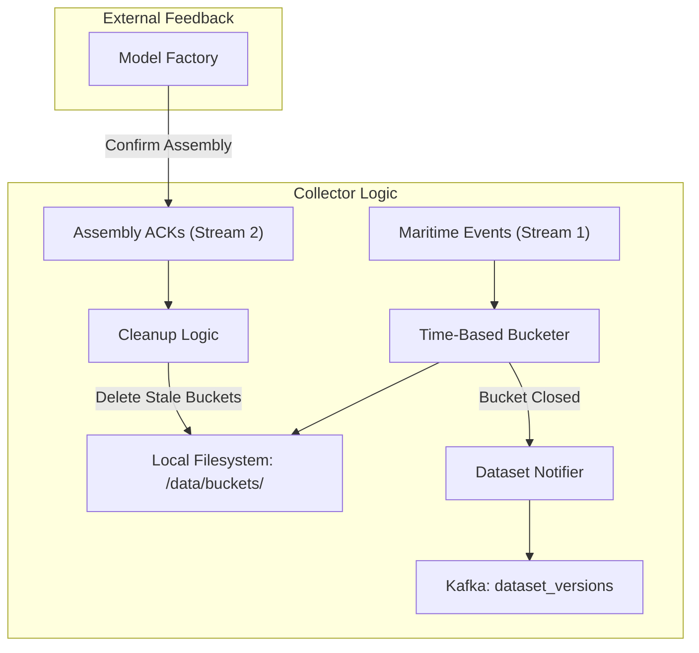

# Collector Component: Flink-RTCEF

The **Collector** is the data persistence layer of the Flink-RTCEF system. It bridges the gap between high-velocity volatile data streams and the persistent datasets required for model training and optimization in the Model Factory.

## 1. Architectural Role

The Collector resides within the `InferenceJob` but acts as an independent data management service. It processes incoming maritime events and translates them into time-bucketed physical storage.

### Key Responsibilities

- **Data Bucketing**: Grouping raw events into fixed-duration time windows (buckets).
- **Dataset Orchestration**: Notifying the system when a new range of buckets is ready for assembly.
- **Resource Management**: Implementing a feedback-driven retention policy to prevent disk saturation.

---

## 2. Infrastructure & storage

### Time-Indexed Buckets

The Collector stores data in a flat file structure on the local filesystem. Each bucket is named using a consistent prefix and its starting timestamp (normalized to the bucket size).

- **Format**: CSV (matches the original maritime schema).
- **Partitioning**: When Flink parallelism is > 1, the Collector uses a suffix pattern (`_part-X`) to allow multiple subtasks to write simultaneously to the same logical bucket without locking contention.

### The Feedback Loop (ACK System)

Unlike traditional TTL-based cleanup, the Collector uses a **strict acknowledgment protocol** to ensure data integrity during long-running optimization sessions.

1. **Emit**: When a bucket closes, the Collector emits a notification to Kafka (`dataset_versions`).
2. **Process**: The Model Factory assembles these buckets into a training dataset.
3. **ACK**: Once the Factory successfully reads and copies/locks the data, it emits an "Assembly Report" ACK.
4. **Purge**: The Collector only deletes buckets that have been explicitly acknowledged as processed by the Factory. This prevents data loss if the Factory lags behind.

---

## 3. Software Implementation

### The `CoProcessFunction` Pattern

The Collector is implemented as a `CoProcessFunction` to handle the dual-stream nature of its task:

- **`processElement1` (Events)**:
  - Calculates the bucket ID: `timestamp - (timestamp % bucketSize)`.
  - Handles transitions (closing the current bucket and opening a new one).
  - Writes the record to disk using `StandardOpenOption.SYNC` to ensure OS-level persistence.
- **`processElement2` (ACKs)**:
  - Parses JSON acknowledgments from the `assembly_reports` topic.
  - Updates a `safeDeletionThreshold`.
  - Triggers a cleanup scan of the filesystem.

### Fault Tolerance & State

To survive job restarts, the Collector:

- Scans its disk directory on `open()` to rebuild its internal history of active buckets.
- Uses Flink's managed state to track the current dataset version and notification counters.

---

## 4. Interactions & Data Flow

- **Upstream (InferenceJob)**: Receives the parsed `GenericEvent` stream.
- **Downstream (Model Factory)**: Indirectly provides data via the filesystem; directly coordinates via the `dataset_versions` Kafka topic.
- **Feedback (Model Factory)**: Receives confirmation via the `assembly_reports` topic.

---

## 5. Why This Design?

1. **Decoupling**: The Inference Engine can continue to process events even if the Model Factory is busy or offline.
2. **Persistence**: By writing to disk, we bypass the memory limits of Flink state for large datasets.
3. **Safety**: The ACK-based cleanup ensures that the dataset used for the "Ask" part of Bayesian optimization remains available until the "Tell" part is complete, even if the optimization takes hours.
4. **Scalability**: Subtask-based indexing allows the Collector to scale linearly with the rest of the Flink cluster.
