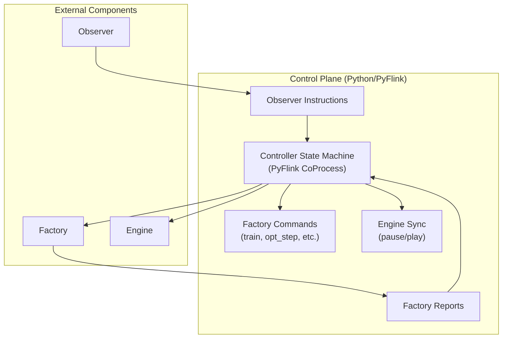

# Controller Component: Flink-RTCEF

The **Controller** is the central orchestrator of the Flink-RTCEF adaptation loop. Implemented as a PyFlink job, it manages the state machine for model optimization, specifically leveraging Bayesian optimization to refine hyperparameters in real-time.

## 1. Architectural Role

The Controller acts as the "Command and Control" center. it decouples the **Observer** (which detects when to change) from the **Model Factory** (which performs the heavy lifting of training).

### Key Responsibilities

- **Optimization Orchestration**: Managing the "Ask-Tell" loop for Bayesian optimization.
- **Lifecycle Management**: Tracking the state of optimization sessions (Initializing -> Optimizing -> Finalizing).
- **System Synchronization**: Issuing `pause` and `play` signals to the Inference Engine to maintain consistency.
- **Fault-Tolerant State**: Persisting the optimizer's internal Bayesian model in Flink's managed state.

---

## 2. Bayesian Optimization Logic

The Controller uses **Scikit-Optimize (skopt)** to find the best hyperparameters for the Wayeb engine (e.g., `pMin`, `gamma`).

### The Ask-Tell Protocol

To avoid blocking the stream, the Controller implements an event-driven version of Bayesian optimization:

1. **ASK**: Upon initialization or after a previous result, the Controller "Asks" the Bayesian model for the next promising hyperparameters to test. It then sends an `opt_step` command to the Model Factory.
2. **WAIT**: The Controller stays in a `WAITING_FOR_REPORT` state, allowing Flink to process other events or checkpoint.
3. **TELL**: When the Model Factory returns a `Report` (containing the MCC score), the Controller "Tells" this result to the Bayesian model to update its internal surrogate function.
4. **ITERATE**: This continues for a fixed number of iterations ($N$ total evaluations).

---

## 3. Synchronization Protocol

To ensure that real-time inference is not negatively impacted by inconsistent model states during optimization, the Controller manages a synchronization protocol:

- **Pause Signal**: Sent to the `enginesync` topic at the start of an optimization session. The Inference Engine suspends processing to prevent "drifted" results.
- **Play Signal**: Sent once the "best" model from the optimization is finalized. It includes the new `model_id` to be loaded by the Engine upon resuming.

---

## 4. Software Implementation

### PyFlink State Machine

The core logic resides in a `ControllerCoProcessFunction`. This function manages two critical pieces of state:

- **`session_state`**: A JSON-serializable snapshot of the current optimization (phase, iteration count, best score found so far).
- **`optimizer_state`**: A Base64-encoded pickle of the `skopt.Optimizer` object. This allows the Bayesian model to survive Flink restarts and task migrations.

### Core Modules

- **`main.py`**: Definiton of the PyFlink execution graph and Kafka consumers/producers.
- **`optimizer.py`**: The `HyperparameterOptimizer` wrapper that handles the integration with `skopt` and state serialization.
- **`sync.py`**: Utilities for constructing standardized pause/play JSON commands.

---

## 5. Deployment & Infrastructure

- **Runtime**: Python 3.9+ within a PyFlink environment.
- **Dependencies**: `apache-flink`, `scikit-optimize`, `kafka-python`.
- **Checkpointing**: Enabled to ensure that an optimization session (which may take minutes to hours) is never lost due to infrastructure failures.

---

## 6. Why This Matters

By moving the optimization logic to a dedicated Python-based Controller, the system gains several advantages:

1. **Mathematical Richness**: Leveraging Python's mature data science ecosystem (`skopt`) for complex optimization algorithms.
2. **Decoupling**: The Java-based Inference Engine remains focused on performance, while the Python Controller handles the high-level adaptation logic.
3. **Consistency**: The synchronization protocol ensures that model updates are orderly and documented, maintaining the integrity of the research experimental results.
