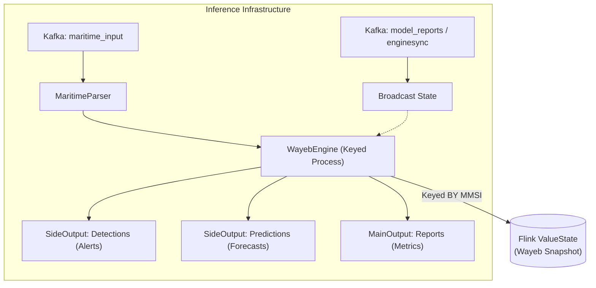

# Inference Engine Analysis: Flink-RTCEF

The **Inference Engine** is the real-time core of the Flink-RTCEF system. Its primary mission is to process high-velocity maritime event streams (AIS), detect complex patterns (recognition), and forecast future events (forecasting) while supporting seamless, live model updates.

## 1. Architectural Overview

The engine is built on top of **Apache Flink**, leveraging its stateful stream processing capabilities. It operates as a distributed system where data and logic are partitioned and synchronized in real-time.



### Key Components

- **InferenceJob**: The entry point that defines the execution graph, source/sink connectors, and checkpointing configuration.
- **WayebEngine**: A `KeyedBroadcastProcessFunction` that acts as the bridge between Flink and the Scala-based Wayeb core. It handles the lifecycle of inference runs and manages per-ship state.
- **Wayeb Core (Scala)**: The actual engine implementing FSM-based detection and SPST-based forecasting.

---

## 2. The Choice of KeyedBroadcastProcessFunction

The system uses this specific Flink pattern to solve a fundamental challenge in real-time adaptive systems: **How to process data at scale while simultaneously updating logic across all processed entities?**

### The Keyed Side (Data Plane)

- **Scale**: Events are partitioned by `mmsi` (ship ID). This allows the engine to scale horizontally across multiple Flink TaskManagers.
- **Persistence**: Each `mmsi` has its own isolated Wayeb state (FSM transitions, buffers, etc.) stored in Flink's `ValueState`.
- **Fault Tolerance**: Flink handles the checkpointing and recovery of these individual states.

### The Broadcast Side (Control Plane)

- **Universal Updates**: Control signals (Pause/Play) and New Models are broadcast to *every* parallel instance of the engine.
- **Coordination**: Every ship, regardless of which task manager it's on, receives the same update signal at practically the same time.

---

## 3. Real-Time Model Adaptation (RTMA)

The engine implements a sophisticated **Zero-Downtime Swap** protocol to update models without losing the current detection context.

### The Swap Protocol

1. **LATEST Model**: When the Model Factory produces a superior model, it's broadcast as a `LATEST` notification.
2. **Synchronization Point**: The engine calculates a future "activation timestamp" based on the event time.
3. **Pausing (Optional)**: For heavy optimizations, a `PAUSE` signal can suspend inference while a new model is prepared.
4. **State-Preserving Swap**:
   - The engine captures a snapshot of the *current* Wayeb execution state.
   - It instantiates the *new* model.
   - It **restores** the execution state into the new model engine.
   - This ensures that a pattern half-detected by Model A continues to be detected by Model B.

---

## 4. Operational Pipeline

### 1. Data Parsing (`MaritimeParser`)

Raw CSV strings from Kafka are converted into symbolic Wayeb events. This involves building a Scala-compatible attribute map that the core engine can interpret.

### 2. Execution Engine (`WayebEngine`)

The engine runs two main parallel logics for every event:

- **Detection Run**: Advances the Finite State Machine (FSM) to look for pattern completion (e.g., "Entering Area").
- **Forecasting Run**: Iterates through the Stochastic Pattern Suffix Tree (SPST) to predict the probability and time window of the next occurrence.

### 3. Output Management

- **Main Stream**: Emits `ReportOutput` containing windowed (Batch) and cumulative (Runtime) performance metrics (MCC, F1, Precision, Recall).
- **Side Outputs**: Non-blocking streams for high-priority alerts (`MATCH_TAG`) and raw forecasting data (`PRED_TAG`).

---

## 5. Control Signal Structure

The engine's reactivity is driven by JSON signals consumed from Kafka.

### Example: Sync Command

```json
{
  "type": "pause",
  "reason": "optimisation_session_start",
  "timestamp": 1674824000
}
```

### Example: Model Update Notification

```json
{
  "status": "success",
  "model_id": 42,
  "model_path": "/opt/flink/data/saved_models/wayeb_model_42.spst",
  "pt": 15000
}
```

---

## 6. Software & Infrastructure Stack

- **Runtime Environment**: Java 11 (JVM).
- **Stream Processor**: Apache Flink 1.15+.
- **Core Engine**: Wayeb (Scala 2.12).
- **State Backend**: RocksDB or Filesystem (via Flink Checkpointing).
- **Inter-Component Bus**: Kafka (for decoupling Inference, Factory, and Controller).

---

## 6. Why This Matters

This architecture ensures that the Flink-RTCEF system is:

- **Reactive**: Detections happen within milliseconds of event arrival.
- **Scalable**: Can handle thousands of ships by increasing Flink parallelism.
- **Adaptive**: The models are constantly improving and can be swapped live based on Observer feedback.
- **Resilient**: Guaranteed exactly-once processing (or at-least-once) through Flink's snapshotting mechanism.
