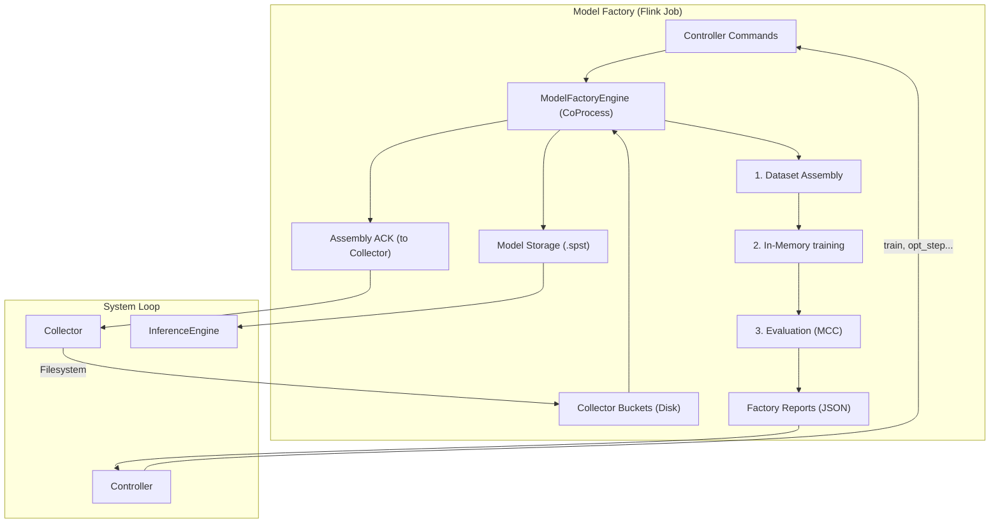

# Model Factory Component: Flink-RTCEF

The **Model Factory** is the computational backbone for model generation and hyperparameter optimization in the Flink-RTCEF system. It processes historical data to train the predictive models used by the real-time Inference Engine.

## 1. Architectural Role

The Model Factory operates as a "Batch-on-Streaming" worker. It consumes high-level commands from the **Controller** and physical data buckets from the **Collector** to produce new, optimized model snapshots.

### Key Responsibilities

- **Dataset Assembly**: Merging multiple time-bucketed CSV files into a unified training dataset.
- **VMM Training**: Executing the Variable Memory Markov (VMM) training algorithm via the Wayeb Core.
- **Hyperparameter Optimization**: Implementing the "worker" side of the Bayesian optimization loop (Ask-Tell protocol).
- **Resource Locking**: Ensuring datasets remain available on disk while an optimization session is active.

---

## 2. Operational Logic

### Dataset Assembly

When the Collector notifies the system of new buckets, the Factory performs an immediate assembly:

1. It reads the specific range of bucket files from the shared volume.
2. It concatenates them into a single versioned CSV file (`dataset_version_X.csv`).
3. It emits an **Assembly ACK** side-output. The Collector uses this ACK to safely delete buckets that are no longer needed by the Factory.

### In-Memory Training & Testing

To maximize performance, the Factory uses a specialized `WayebAdapter` that performs training entirely in memory:

- **Training**: Converts the CSV dataset into Scala GenericEvents and builds the Stochastic Pattern Suffix Tree (SPST).
- **Validation**: During optimization (OPT_STEP), the Factory runs a replica of the inference logic on the *same* training data to calculate the Matthew's Correlation Coefficient (MCC). This ensures the "optimal" parameters found are tailored to the actual data distribution.

---

## 3. The Optimization Protocol (Ask-Tell)

The Factory implements four distinct command handlers for the Controller:

1. **TRAIN**: A simple, one-shot retraining with baseline parameters.
2. **OPT_INITIALISE**: Locks the current dataset, preventing its deletion by the Collector until the optimization session completes.
3. **OPT_STEP**: Executes a training+test cycle for a specific set of hyperparameters provided by the Controller's Bayesian model. It returns the resulting MCC/Loss.
4. **OPT_FINALISE**: Performs a final training run with the "best" discovered parameters, saves the definitive model file, and releases the dataset lock.

---

## 4. Software Implementation

### State Management

The `ModelFactoryEngine` is a stateful Flink `CoProcessFunction` that manages:

- **`currentAssembledDatasetState`**: Path to the latest available dataset.
- **`datasetInUseState`**: Reference counting/locking for active optimization sessions.
- **`optModelParams`**: Transient history of parameters tested during the current session.

### Resource Cleanup

The Factory is responsible for its own experimental artifacts:

- **Intermediate Models**: Models generated during `OPT_STEP` (which can be numerous) are automatically deleted after `OPT_FINALISE`.
- **Stale Datasets**: Assembled CSV files are deleted once a new version is available, provided they aren't locked by an active optimization.

---

## 5. Software & Infrastructure Stack

- **Runtime**: Java 11 (JVM).
- **Engine**: Wayeb Core (Scala 2.12).
- **Serialization**: Jackson for JSON command/report parsing.
- **Storage**: Local/Network volume shared with the Flink JobManager and Collector subtasks.

---

## 6. Why This Design?

- **Decoupled Heavy Lifting**: Training is expensive; by separating it from the Inference Engine, we ensure real-time latency doesn't spike during model updates.
- **Data Locality**: By operating on local buckets rather than piping data through Kafka, we achieve significantly higher throughput for training.
- **Reliability (Locking)**: The explicit acknowledgment and locking mechanism prevents "dataset-not-found" errors that often plague distributed learning pipelines.
