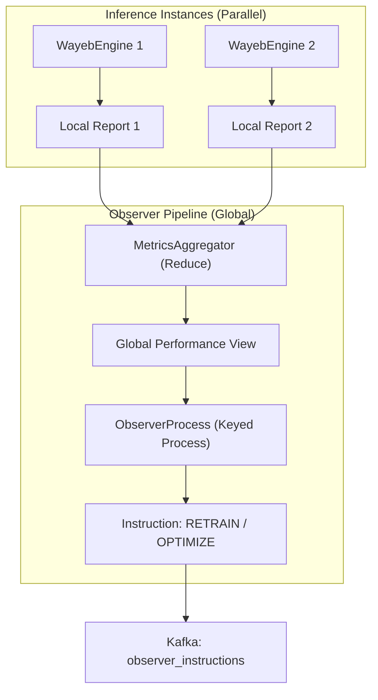

# Observer Component: Flink-RTCEF

The **Observer** is the decision-making "brain" of the Flink-RTCEF closed-loop system. It monitors the real-time performance of the models across the entire distributed cluster and determines when proactive adaptation (retraining or optimization) is required.

## 1. Architectural Role

The Observer acts as the supervisor in the **RTMA (Real-Time Model Adaptation)** protocol. It sits at the end of the inference pipeline, aggregating partial results into a global view to make stable, system-wide decisions.

### Key Responsibilities

- **Performance Aggregation**: Merging distributed confusion matrices into a mathematically sound global performance metric.
- **Health Assessment**: Detecting performance drops (drifts) using the Matthew's Correlation Coefficient (MCC).
- **Instruction Dispatch**: Emitting JSON control signals to the Python Controller to trigger model updates.

---

## 2. Metrics Aggregation Logic

To ensure the Observer makes decisions based on the whole system state, it uses a two-stage aggregation:

### 1. Partial Reports (`WayebEngine`)

Every parallel instance of the inference engine calculates its own local confusion matrix (TP, TN, FP, FN) for both:

- **Runtime**: Cumulative counts since the last model swap.
- **Batch**: Counts within the current reporting window (e.g., last 10 minutes).

### 2. Global Reduction (`MetricsAggregator`)

A Flink `reduceAll` (or `windowAll().reduce()`) operation sums these raw counts globally.
> [!IMPORTANT]
> The Observer **recalculates** derived scores (MCC, Precision, Recall, F1) *after* aggregation. Simply averaging local MCCs would be mathematically incorrect due to varying data densities across parallel instances.

---

## 3. Decision Making (`ObserverProcess`)

The `ObserverProcess` evaluates the global MCC using three main strategies:

### A. Activity Discrimination

To avoid false alarms in silent windows (e.g., low maritime traffic), the Observer ignores evaluation if `TP + FP + FN == 0`. If no predictions or detections occurred, the performance is mechanically undefined.

### B. Adaptive Thresholds

The Observer uses a trend-based assessment over a history of $k$ windows:

- **Major Drop**: If $MCC_{prev} - MCC_{curr} > \text{optDiffThreshold}$, it triggers an **OPTIMIZE** session (Bayesian optimization).
- **Minor Drop**: If $MCC_{prev} - MCC_{curr} > \text{trainDiffThreshold}$, it triggers a simple **RETRAIN** (VMM update with current best params).
- **Safety Net**: If $MCC_{curr} < \text{lowScoreThreshold}$, it immediately triggers an **OPTIMIZE** regardless of trend.

### C. Grace Period Management

After a new model is deployed, the Observer enters a **Grace Period**. It ignores performance metrics for a fixed number of windows to allow the new model to "warm up" and produce a stable statistical baseline.

---

## 4. Interaction & Data Flow

- **Input**: Consumes `ReportOutput` objects from the `WayebEngine` via the `MetricsAggregator`.
- **Output**: Emits JSON instructions to the `observer_instructions` Kafka topic.
- **Closed Loop**: These instructions are picked up by the Python **Controller**, which then orchestrates the **Model Factory**. Once the Factory produces a new model, the cycle completes when the **Inference Engine** swaps to the new model.

---

## 5. Software Implementation Details

- **Scaling**: While the Inference Engine is highly parallel, the Observer aggregation is a global bottleneck by design to ensure consistency. It typically runs with a parallelism of 1.
- **Statefulness**: Uses Flink `ListState` to maintain the windowed history of scores and `ValueState` for the grace period countdown and instruction ID tracking.
- **JSON Protocol**: Outputs instructions in a format compatible with the `skopt_wrapper.py` in the Python controller.
