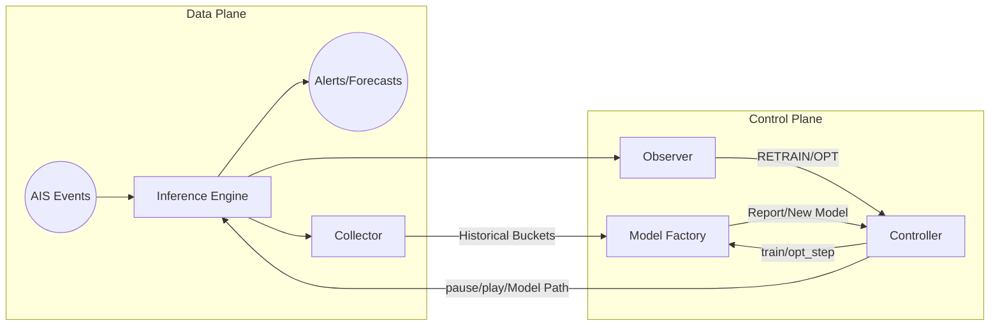

# System Overview: Flink-RTCEF

**Flink-RTCEF** (Real-Time Complex Event Forecasting) is a distributed, closed-loop stream processing system designed for maritime traffic monitoring. It combines high-throughput event detection and forecasting (recognition) with proactive, real-time model adaptation (optimization).

## 1. High-Level Architecture

The system is designed as a **Closed-Loop Feedback System** where the output (performance) is constantly monitored to trigger improvements in the processing logic (models).

---

## 2. Core Functional Components

The system is composed of five specialized components distributed across Java and Python runtimes:

| Component | Runtime | Role | Key Responsibility |
| :--- | :--- | :--- | :--- |
| **Inference Engine** | Java/Flink | Real-time Worker | Processes live AIS streams, detects events, and forecasts future risks. |
| **Collector** | Java/Flink | Data Custodian | Buckets live data into time-indexed CSV files for historical persistence. |
| **Observer** | Java/Flink | Performance Auditor | Aggregates global metrics and detects model performance degradation (drift). |
| **Controller** | Python/PyFlink| Orchestrator | Manages the State Machine for Bayesian hyperparameter optimization. |
| **Model Factory**| Java/Flink | Knowledge Generator | Trains new VMM/SPST models using historical data buckets. |

---

## 3. The RTMA Protocol (Real-Time Model Adaptation)

The heart of the system is the **Real-Time Model Adaptation (RTMA)** protocol, which ensures models stay accurate as maritime patterns evolve:

1. **Monitor**: The **Observer** detects that the current model's Matthew's Correlation Coefficient (MCC) has dropped below a threshold.
2. **Orchestrate**: The **Controller** receives an instruction and starts an optimization session, sending a `pause` signal to the **Inference Engine**.
3. **Optimize**: The **Controller** runs a Bayesian "Ask-Tell" loop, commanding the **Model Factory** to test various hyperparameter candidates against historical data provided by the **Collector**.
4. **Deploy**: Once the best model is identified, the **Controller** sends a `play` signal with the new model path. The **Inference Engine** performs a state-preserving swap and resumes processing.

---

## 4. Infrastructure & Data Backbone

### Message Bus (Kafka)

The system is entirely decoupled via **Kafka**. Topics serve as the "nerves" of the cluster:

- `maritime_input`: Raw AIS data.
- `model_reports`: Performance metrics from Inference to Observer/Controller.
- `observer_instructions`: Control signals from Observer to Controller.
- `factory_commands`: Actionable tasks from Controller to Factory.
- `enginesync`: Synchronization signals (pause/play) for the Inference Engine.

### Persistent Storage

- **Shared Volume**: A high-performance disk volume (e.g., Lustre, NFS, or Docker Volume) shared between Flink subtasks and the Python container.
- **Data Buckets**: Managed by the Collector, providing a searchable historical backbone.
- **Model Registry**: Stores serialized Wayeb models (`.spst`) indexed by ID.

---

## 5. Deployment Summary

- **Framework**: Apache Flink (Java) and PyFlink (Python).
- **Orchestration**: Docker Compose (Development) / Kubernetes (Production).
- **Core Technology**: Wayeb (Symbolic Pattern Recognition and Stochastic Forecasting).
- **Target OS**: Linux/macOS.

---

## 6. Project Value Proposition

Flink-RTCEF solves the "decay" problem in machine learning for streaming data. By combining the low-latency guarantees of **Apache Flink** with the mathematical flexibility of **Python-based Bayesian optimization**, it provides a system that is not only fast but also continuously self-correcting.
